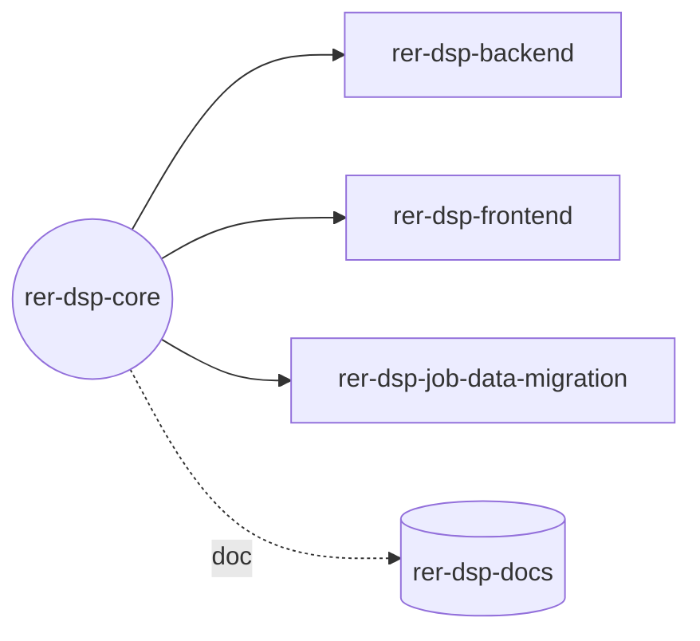

# rer-dsp-core

> Este repositório é um dos módulos do **DSP (Data Sharing Platform)**, parte do ecossistema RER.
> A documentação completa do projeto está em **[rer-dsp-docs](https://github.com/Rural-Environmental-Registry/rer-dsp-docs)**.
> As informações abaixo tratam apenas deste módulo, não do projeto DSP como um todo.

## Qual parte do DSP este módulo é



## Objetivo

Orquestra, via Docker Compose, os bancos de dados (PostgreSQL/PostGIS), o GeoServer e a
configuração do adotante para toda a stack DSP.

## Responsabilidades

- Subir e configurar os bancos de dados (`dsp-db`, `dsp-job-migration-db`)
- Subir o GeoServer de exibição (WMS)
- Guiar a configuração do adotante (hierarquia, telas, KPIs, camadas do mapa)
- Orquestrar os demais módulos via Docker Compose

## Tecnologias

Docker Compose, PostgreSQL/PostGIS, GeoServer, Bash, Python.

## Como executar

```bash
cp .env.example .env
./config.sh
./setup.sh
./start.sh
```

## Licença

[GNU General Public License v3.0](LICENSE)
